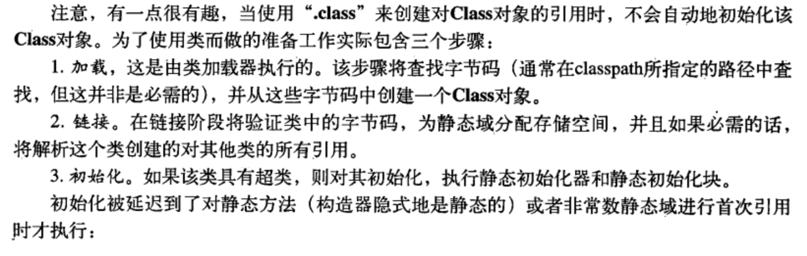
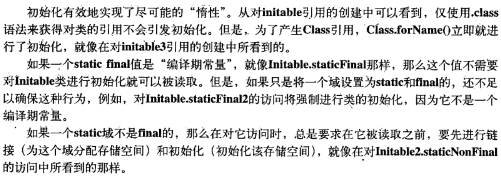
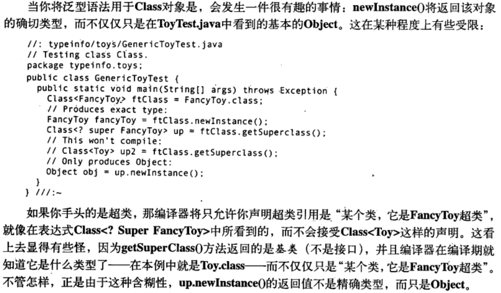
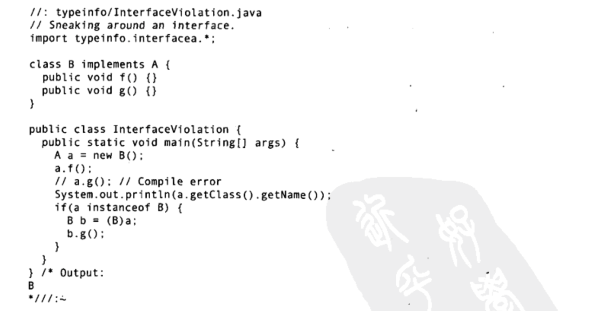
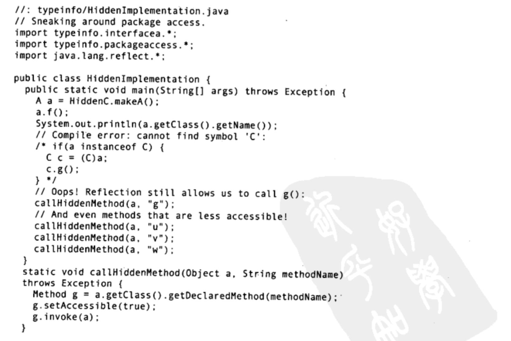

# Thinking in Java

## s14 类型信息

### 运行时类型信息 RTTI(RunTime Type Infomation)

运行时类型信息使得你可以在程序运行时发现和使用类型信息。

---

### Class对象

Class类拥有大量使用RTTI的方法。

被编译的新类会产生.class文件，即一个Class对象，在运行时被JVM的类加载器加载。

~~~
Class abc = Class.forName("com.gxd.abc");
abc.newInstance();
~~~

### 类字面常量

用于生成对Class对象的引用，更简单安全，并且编译时会受到检查（无需try-catch），根除了forName的调用，所以也更高效。

~~~
Class abc = abc.class
~~~

**类的准备工作**

**初始化顺序及“惰性”**

### 泛化的Class引用

Class引用总是指向某个Class对象，它可以制造类的实例，并包含可以作用于这些实例的所有方法代码和该类的静态成员。

~~~
//代码不会报错，因为没有指定类型，但是建议使用Class<?>来代替
Class genericNumberClass = int.class;
genericNumberClass = number.class;

//编译器会报错，因为Integer虽然继承了Number，但是Integer Class对象不是Number Class对象的子类
Class<Number> genericNumberClass = int.class;

//上述错误的正确写法应该为：
Class<? extends Number> bounded = int.class;
bounded = double.class;
~~~

**newInstance返回对象的类型**

### 类型转换语法
Class的cast()方法，用于类型转换

~~~
Building b = new House();
Class<House> houseClass = House.class;
//等价于 House h = (House)b;
House h = houseClass.cast(b);
~~~

---

### 类型转换前先做检查

**RTTI的形式**
1. 传统类型转换，会由RTTI来保证转换的正确性，否则报ClassCastException
2. Class对象包含了RTTI 
3. instanceof() 返回一个布尔值

### 动态的instanceof

使用class的方法isInstance来代替instanceof

~~~
Integer i = 5;
//等价于 if(i instanceof Integer)
Class<?> intClass = Integer.class;
intClass.isInstance(i);
~~~

### Class.isAssignableFrom()

**对比: instanceof isInstance isAssignableFrom**
* instanceof 语法为"obj instanceof class" 并且类必须为类字面常量，不可为变量
* isInstance 语法为"class.isInstance(obj)" 类可以为动态的Class<?> aClass 
* isAssignableFrom 语法为"parentClass.isAssignableFrom(subClass)" 用于判断类的继承关系

---

### 反射：运行时的类信息
RTTI可以告诉你某个对象的确切类型，但是这个类型必须在编译时已知。

Class类和java.lang.reflect类库为反射提供支持，包含了Field,Method,Constructor类（均实现了Member接口），这些对象由JVM在运行时创建，用以表示未知类的成员。

~~~
getFields();
getMethods();
getConstructors();
~~~

RTTI vs 反射
* RTTI是在编译时打开和检查.class文件
* 反射是在编译时无法获得.class文件，在运行时打开和检查.class文件

不过过分纠结RTTI还是Reflect，统一当做反射理解

---

### * 动态代理

~~~
Proxy.newProxyInstance();
InvocationHandler();
invoke();
~~~

### * 空对象

---

### 接口与类型信息

interface虽然可以隔离构件，降低耦合，但是通过反射，这种耦合还是可以传播出去。

**强制转换调用隐藏方法**

如果通过将类改为protected、private，隐藏类型，则无法强制转换，则可以通过下述方法反射调用隐藏方法

**反射调用隐藏方法**

将类变为私有内部类、匿名内部类，也无法避免反射调用隐藏方法。

final域在遭遇反射修改时是安全的。运行时系统会在不抛出任何异常的情况下接收任何修改尝试，但是不会发生实际修改。

