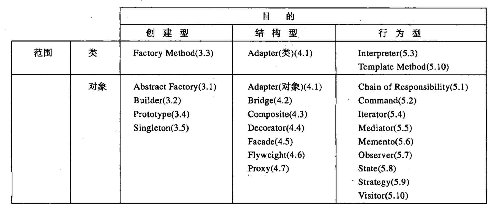
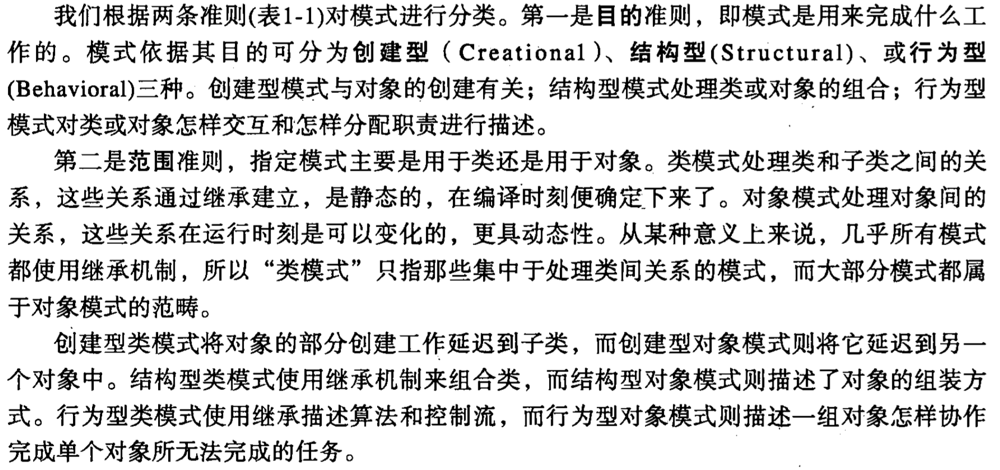
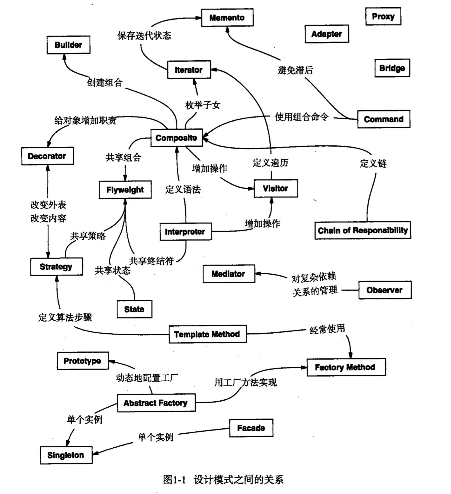

# 引言

### 什么是设计模式

每一个模式描述了一个在我们周围不断重复发生的问题，以及该问题的解决方案的核心。这样，你就能一次又一次地使用该方案而不必做重复劳动。

### 四个要素：
* A、模式名称（pattern name）:助记名，用一两个词来描述模式的问题、解决方案和效果。

* B、问题（problem）：描述了应该在何时使用模式。

* C、解决方案（solution）：描述了设计的组成成分，它们之间的相互关系及各自的职责和协作方式。

* D、效果（consequences）：描述了模式应用的效果及使用模式应权衡的问题。

### 组织编目

**设计模式空间**

**设计模式空间划分准则**

**设计模式之间的关系**

### 面向对象设计原则
* 针对接口编程，而不是针对实现编程。
* 优先使用对象组合，而不是类继承。

